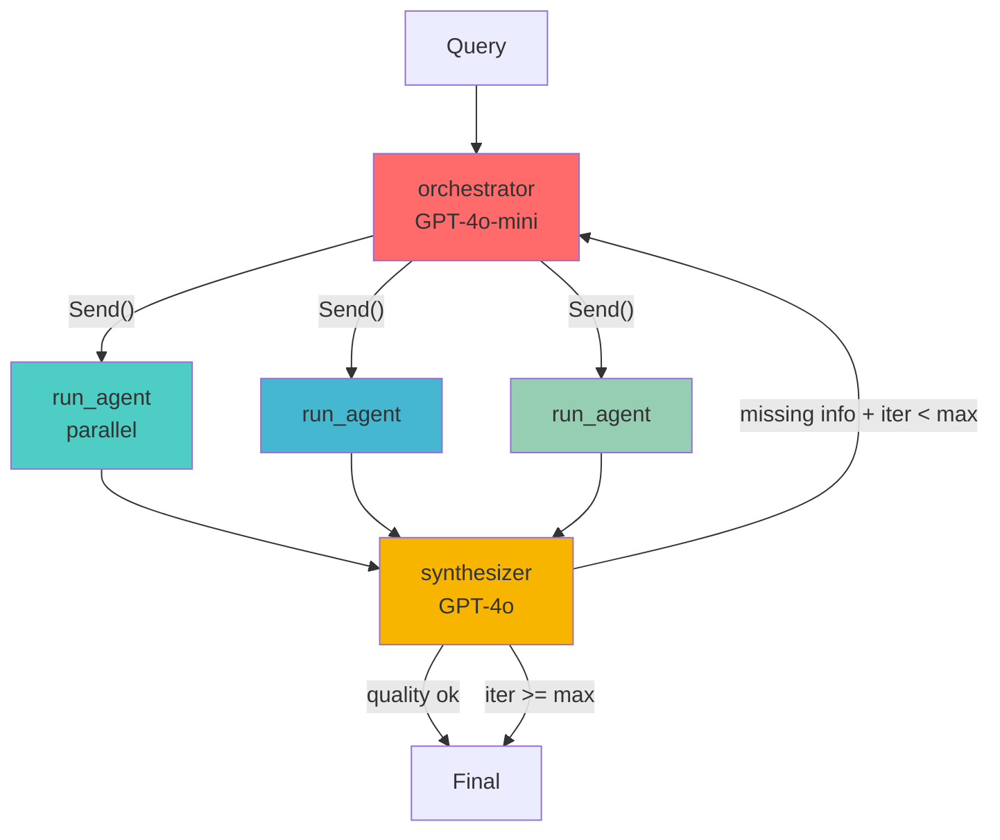

# Plan 4: LangGraph Workflow (v2 - with 3 fixes)

## Overview

Build LangGraph StateGraph with parallel agent execution using Send() API.

## Architecture



## 3 Critical Fixes

### Fix 1: Parallel via Send() API

```python
# OLD: Sequential (slow)
for agent_name in selected:
    result = run_agent(agent_name, query)

# NEW: Parallel (fast) - LangGraph handles concurrency
return [
    Send("run_agent", AgentInvokeState(query=query, agent_name=agent_name))
    for agent_name in selected
]
```

### Fix 2: Lambda Bug Fix

```python
# OLD: Lambda in loop causes late binding bug
for agent_name in AGENT_REGISTRY.keys():
    builder.add_conditional_edges(
        "orchestrator",
        lambda state, agent=agent_name: agent in state.get("selected_agents", []),
        {agent_name: agent_name}
    )

# NEW: Dict comprehension + Send direct (no lambda)
return [
    Send("run_agent", AgentInvokeState(query=query, agent_name=agent_name))
    for agent_name in selected
]
```

### Fix 3: Real Answer Quality Check

```python
def should_continue(state: AgentState) -> str:
    iterations = state.get("iterations", 0)
    missing_info = state.get("missing_info", False)
    answer = state.get("answer", "")

    # Hard stop at max iterations
    if iterations >= MAX_ITERATIONS:
        return END

    # Quality check
    if not missing_info and len(answer) >= MIN_ANSWER_LENGTH:
        return END

    # Need more info
    return "orchestrator"
```

## Files

## File: `agentic_rag/state.py`

```python
"""State definition for LangGraph multi-agent workflow."""

from typing import TypedDict, Annotated, Sequence, Optional
from langgraph.graph import add_messages
from langchain_core.messages import BaseMessage


class AgentState(TypedDict):
    """Shared state across all nodes."""

    messages: Annotated[Sequence[BaseMessage], add_messages]
    query: str
    selected_agents: list[str]
    agent_results: dict[str, str]
    answer: Optional[str]
    iterations: int
    missing_info: bool


class AgentInvokeState(TypedDict):
    """State for individual agent invocation via Send()."""
    query: str
    agent_name: str
```

## File: `agentic_rag/graph.py`

````python
"""LangGraph multi-agent workflow with Send() parallel execution."""

import json
import traceback
from typing import Literal

from langgraph.graph import StateGraph, END
from langgraph.types import Send
from langchain_openai import ChatOpenAI
from langsmith import trace

from .state import AgentState, AgentInvokeState
from .agents import (
    run_pdf_agent,
    run_web_agent,
    run_calculator_agent,
    run_wikipedia_agent,
    run_code_agent,
    run_sql_agent,
)


AGENT_REGISTRY: dict[str, callable] = {
    "pdf_agent":        run_pdf_agent,
    "web_agent":        run_web_agent,
    "calculator_agent": run_calculator_agent,
    "wikipedia_agent":  run_wikipedia_agent,
    "code_agent":       run_code_agent,
    "sql_agent":        run_sql_agent,
}

AGENT_DESCRIPTIONS = {
    "pdf_agent":        "tài liệu PDF nội bộ, chính sách, hợp đồng",
    "web_agent":        "tin tức hiện tại, thông tin mới nhất từ internet",
    "calculator_agent": "tính toán số học, công thức, chuyển đổi đơn vị",
    "wikipedia_agent":  "kiến thức bách khoa, định nghĩa, lịch sử",
    "code_agent":       "viết và chạy Python code, xử lý dữ liệu",
    "sql_agent":        "truy vấn database, thống kê, báo cáo dữ liệu",
}

MAX_ITERATIONS = 2
MIN_ANSWER_LENGTH = 80


ROUTING_PROMPT_TEMPLATE = """Bạn là router cho hệ thống multi-agent RAG.
Phân tích query và chọn đúng agents cần thiết.

Query: {query}

Agents có sẵn:
{agent_list}

Lần thử trước (nếu có): {previous_attempt}

Quy tắc:
- Chỉ chọn agents thực sự cần thiết, không chọn thừa
- Nếu là câu hỏi toán: chỉ calculator_agent
- Nếu hỏi kiến thức chung: chỉ wikipedia_agent
- Nếu cần nhiều nguồn: chọn tối đa 3 agents
- Nếu lần trước đã thử và thiếu thông tin: chọn agents bổ sung

Trả về JSON hợp lệ duy nhất (không giải thích thêm):
{{"agents": ["agent1", "agent2"], "reasoning": "lý do ngắn gọn"}}"""


@trace(name="orchestrator", tags=["orchestrator"])
def orchestrator_node(state: AgentState) -> list[Send]:
    """Fan-out to selected agents in parallel via Send()."""
    query = state["query"]
    iterations = state.get("iterations", 0)
    previous_results = state.get("agent_results", {})

    previous_attempt = "Chưa có" if not previous_results else (
        f"Đã dùng: {list(previous_results.keys())} — "
        f"câu trả lời chưa đủ, cần thêm thông tin"
    )

    agent_list = "\n".join(
        f"- {name}: {desc}"
        for name, desc in AGENT_DESCRIPTIONS.items()
    )

    llm = ChatOpenAI(model="gpt-4o-mini", temperature=0)

    routing_prompt = ROUTING_PROMPT_TEMPLATE.format(
        query=query,
        agent_list=agent_list,
        previous_attempt=previous_attempt,
    )

    response = llm.invoke(routing_prompt)

    try:
        content = response.content.strip()
        if content.startswith("

```"):
            content = content.split("

```")[1]
            if content.startswith("json"):
                content = content[4:]
        parsed = json.loads(content.strip())
        selected = [a for a in parsed.get("agents", []) if a in AGENT_REGISTRY]
    except (json.JSONDecodeError, KeyError, IndexError):
        selected = ["wikipedia_agent"]

    if not selected:
        selected = ["wikipedia_agent"]

    # FIX 1 + 2: Send() parallel fan-out, no lambda bug
    return [
        Send("run_agent", AgentInvokeState(query=query, agent_name=agent_name))
        for agent_name in selected
    ]


@trace(name="run_agent", tags=["agent"])
def run_agent_node(state: AgentInvokeState) -> dict:
    """Generic agent node - handles all agent types."""
    agent_name = state["agent_name"]
    query = state["query"]

    agent_func = AGENT_REGISTRY.get(agent_name)
    if not agent_func:
        return {"agent_results": {agent_name: f"Agent '{agent_name}' không tồn tại."}}

    try:
        result = agent_func(query)
        if not result or not str(result).strip():
            result = f"{agent_name}: Không tìm thấy thông tin liên quan."
    except Exception as e:
        traceback.print_exc()
        result = f"{agent_name} gặp lỗi: {str(e)}"

    return {"agent_results": {agent_name: str(result)}}


SYNTHESIS_PROMPT_TEMPLATE = """Bạn là synthesizer cho hệ thống multi-agent RAG.
Tổng hợp thông tin từ các agents và trả lời query.

Query gốc: {query}
Lần thử: {iteration}/{max_iter}

Kết quả từ agents:
{results_text}

Hướng dẫn:
- Tổng hợp thông tin thành câu trả lời mạch lạc, đầy đủ
- Nếu agents có thông tin mâu thuẫn, ghi rõ sự khác biệt
- Nếu thiếu thông tin quan trọng, ghi rõ phần nào còn thiếu
- Trả lời bằng tiếng Việt trừ khi query dùng ngôn ngữ khác
- Độ dài tối thiểu: 2-3 câu hoàn chỉnh"""


@trace(name="synthesizer", tags=["synthesizer"])
def synthesizer_node(state: AgentState) -> dict:
    """Synthesize results from all agents."""
    query = state["query"]
    results = state.get("agent_results", {})
    iterations = state.get("iterations", 0) + 1

    if not results:
        return {
            "answer": "Không thu thập được thông tin từ agents.",
            "iterations": iterations,
            "missing_info": True,
        }

    results_text = "\n\n".join(
        f"[{agent.upper()}]\n{result}"
        for agent, result in results.items()
    )

    llm = ChatOpenAI(model="gpt-4o", temperature=0)

    response = llm.invoke(
        SYNTHESIS_PROMPT_TEMPLATE.format(
            query=query,
            iteration=iterations,
            max_iter=MAX_ITERATIONS,
            results_text=results_text,
        )
    )

    answer = response.content.strip()
    missing_info = _detect_missing_info(answer)

    return {
        "answer": answer,
        "iterations": iterations,
        "missing_info": missing_info,
    }


def _detect_missing_info(answer: str) -> bool:
    """Check if answer is missing information."""
    if len(answer) < MIN_ANSWER_LENGTH:
        return True

    insufficient_signals = [
        "không tìm thấy", "không có thông tin", "cần thêm thông tin",
        "không thể trả lời", "thiếu dữ liệu",
        "no information", "could not find", "unable to answer",
    ]
    answer_lower = answer.lower()
    return any(signal in answer_lower for signal in insufficient_signals)


# FIX 3: Real loop logic
def should_continue(state: AgentState) -> Literal["orchestrator", "__end__"]:
    """Decide whether to loop or end based on answer quality."""
    iterations = state.get("iterations", 0)
    missing_info = state.get("missing_info", False)
    answer = state.get("answer", "")

    if iterations >= MAX_ITERATIONS:
        return END

    if not missing_info and len(answer) >= MIN_ANSWER_LENGTH:
        return END

    return "orchestrator"


def create_agent_graph():
    """Build LangGraph with Send() parallel execution."""
    builder = StateGraph(AgentState)

    builder.add_node("orchestrator", orchestrator_node)
    builder.add_node("run_agent", run_agent_node)
    builder.add_node("synthesizer", synthesizer_node)

    builder.set_entry_point("orchestrator")

    # run_agent → synthesizer (after all Send() complete)
    builder.add_edge("run_agent", "synthesizer")

    # FIX 3: Real loop logic
    builder.add_conditional_edges(
        "synthesizer",
        should_continue,
        {"orchestrator": "orchestrator", END: END},
    )

    return builder.compile()
````

## 3 Fixes Summary

| Fix       | Before                            | After                             |
| --------- | --------------------------------- | --------------------------------- |
| **Fix 1** | Sequential agent execution (slow) | `Send()` API - parallel fan-out   |
| **Fix 2** | Lambda in loop (late binding bug) | Dict comprehension + Send direct  |
| **Fix 3** | Always `return END`               | Real quality check + loop control |

## Next Steps

After LangGraph workflow, proceed to: [5-langsmith-observability.plan.md](./5-langsmith-observability-plan.md)
