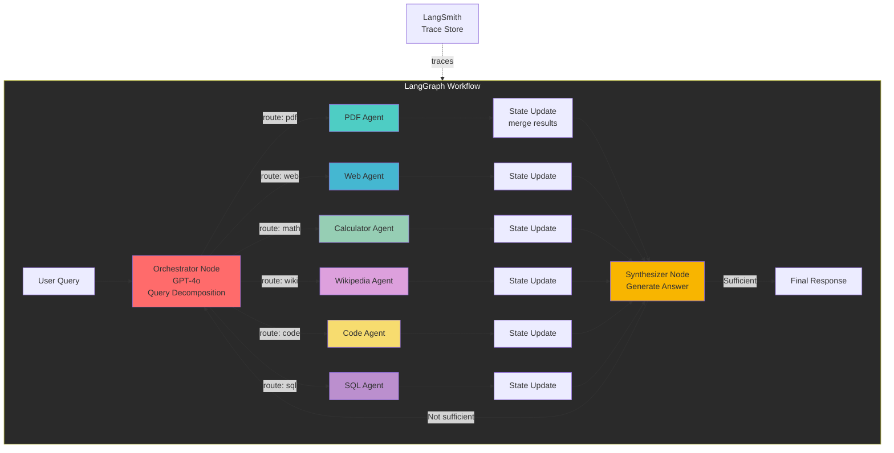

# Build Agentic RAG System (LangGraph + LangSmith)

## Architecture Overview



## LangGraph vs ThreadPoolExecutor

| Aspect        | ThreadPoolExecutor (Before) | LangGraph (After)     |
| ------------- | --------------------------- | --------------------- |
| Flow Control  | Manual                      | Graph-based           |
| State         | Lost between calls          | Persists in State     |
| Routing       | Hard-coded                  | Conditional edges     |
| Debugging     | Print statements            | LangSmith traces      |
| Resumable     | No                          | Yes - checkpoints     |
| Human-in-loop | Difficult                   | Easy - approval edges |

## LangSmith Features

| Feature        | Purpose                                     |
| -------------- | ------------------------------------------- |
| **Traces**     | Every agent call logged with inputs/outputs |
| **Spans**      | Nested spans for nested operations          |
| **Datasets**   | Q&A pairs for evaluation                    |
| **Evaluators** | Custom metrics (faithfulness, relevancy)    |

## File Structure

```
d:/Tool-Airdrop/RAG/
├── config.py                    # Existing - shared setup
├── api.py                       # Existing - FastAPI (unchanged)
├── agentic_rag/
│   ├── __init__.py
│   ├── tools.py                # 6 base tools (@tool decorator)
│   ├── graph.py                # LangGraph StateGraph workflow
│   ├── state.py                # AgentState definition
│   ├── agents/
│   │   ├── __init__.py
│   │   ├── pdf_agent.py       # PDF RAG specialist
│   │   ├── web_agent.py       # Web search specialist
│   │   ├── calculator_agent.py
│   │   ├── wikipedia_agent.py
│   │   ├── code_agent.py
│   │   └── sql_agent.py
│   ├── memory.py               # ChatMessageHistory wrapper
│   └── chain.py                # Graph invocation wrapper
├── agentic_chatbot.py           # New CLI chatbot
├── agentic_api.py              # New FastAPI
└── requirements.txt            # Add langchain-graph, langsmith
```

## Implementation Steps

### Step 1: Setup Dependencies

**Modify**: `requirements.txt`

```
langchain-tavily
wikipedia
langgraph
langsmith
```

**Setup LangSmith** (in `agentic_rag/__init__.py`):

```python
import os
from langsmith import Client

os.environ["LANGCHAIN_TRACING_V2"] = "true"
os.environ["LANGCHAIN_API_KEY"] = os.getenv("LANGSMITH_API_KEY", "")
os.environ["LANGCHAIN_PROJECT"] = "agentic-rag"

client = Client()
```

### Step 2: Define Agent State

**File**: `agentic_rag/state.py`

```python
"""State definition for LangGraph multi-agent workflow."""

from typing import TypedDict, Annotated, Sequence, Optional
from langgraph.graph import add_messages
from langchain_core.messages import BaseMessage


class AgentState(TypedDict):
    """State shared across all nodes in the graph."""

    # Conversation history
    messages: Annotated[Sequence[BaseMessage], add_messages]

    # Original query
    query: str

    # Which agents to call
    selected_agents: list[str]

    # Results from each agent (merged via reducer)
    agent_results: dict[str, str]

    # Final answer
    answer: Optional[str]

    # Iteration count
    iterations: int

    # Whether answer is missing information
    missing_info: bool


class AgentInvokeState(TypedDict):
    """State for individual agent invocation via Send()."""
    query: str
    agent_name: str
```

### Step 3: Implement Base Tools

**File**: `agentic_rag/tools.py` (same as previous plan)

```python
"""Base tools for all agents - using @tool decorator."""

from langchain_core.tools import tool
# ... (same tools as previous plan: pdf_retriever, web_search, calculator, wikipedia, code_executor, sql_database)
```

### Step 4: Create Specialist Agents

**File**: `agentic_rag/agents/pdf_agent.py`

```python
"""PDF Agent - Specialized agent for PDF document search."""

import traceback
from langchain import hub
from langchain.agents import create_react_agent
from langchain_core.tracers import LangChainTracer
from langchain_openai import ChatOpenAI
from langsmith import trace
from agentic_rag.tools import pdf_retriever


def create_pdf_agent():
    llm = ChatOpenAI(model="gpt-4o-mini", temperature=0)
    prompt = hub.pull("hwchase17/react")
    agent = create_react_agent(llm, [pdf_retriever], prompt=prompt)
    return agent


@trace(name="pdf_agent", tags=["agent", "pdf"])
def run_pdf_agent(query: str, tracer: LangChainTracer = None) -> str:
    """Run PDF agent to search documents."""
    agent = create_pdf_agent()

    if tracer:
        config = {"callbacks": [tracer]}
    else:
        config = {}

    try:
        result = agent.invoke({"input": query}, config=config)
        return result.get("output", "No result")
    except Exception as e:
        traceback.print_exc()
        return f"Error: {str(e)}"
```

**Similarly for**: `web_agent.py`, `calculator_agent.py`, `wikipedia_agent.py`, `code_agent.py`, `sql_agent.py`

### Step 5: Build LangGraph Workflow (v2 - with 3 fixes)

**File**: `agentic_rag/graph.py`

````python
"""LangGraph multi-agent workflow — 3 fixes applied:
  1. Parallel agents via Send() API
  2. Routing bug (lambda late binding) fixed with Send direct
  3. Loop logic with real answer quality check
"""

import json
import traceback
from typing import Literal
from functools import partial

from langgraph.graph import StateGraph, END
from langgraph.types import Send
from langchain_openai import ChatOpenAI
from langsmith import trace

from .state import AgentState, AgentInvokeState
from .agents import (
    run_pdf_agent,
    run_web_agent,
    run_calculator_agent,
    run_wikipedia_agent,
    run_code_agent,
    run_sql_agent,
)


# ─────────────────────────────────────────────────────────────────────────────
# Agent registry
# ─────────────────────────────────────────────────────────────────────────────

AGENT_REGISTRY: dict[str, callable] = {
    "pdf_agent":        run_pdf_agent,
    "web_agent":        run_web_agent,
    "calculator_agent": run_calculator_agent,
    "wikipedia_agent":  run_wikipedia_agent,
    "code_agent":       run_code_agent,
    "sql_agent":        run_sql_agent,
}

AGENT_DESCRIPTIONS = {
    "pdf_agent":        "tài liệu PDF nội bộ, chính sách, hợp đồng",
    "web_agent":        "tin tức hiện tại, thông tin mới nhất từ internet",
    "calculator_agent": "tính toán số học, công thức, chuyển đổi đơn vị",
    "wikipedia_agent":  "kiến thức bách khoa, định nghĩa, lịch sử",
    "code_agent":       "viết và chạy Python code, xử lý dữ liệu",
    "sql_agent":        "truy vấn database, thống kê, báo cáo dữ liệu",
}

MAX_ITERATIONS = 2
MIN_ANSWER_LENGTH = 80  # ký tự — dưới ngưỡng này coi là chưa đủ


# ─────────────────────────────────────────────────────────────────────────────
# FIX 1 + FIX 2: Orchestrator — Send() fan-out + no lambda bug
# ─────────────────────────────────────────────────────────────────────────────

ROUTING_PROMPT_TEMPLATE = """Bạn là router cho hệ thống multi-agent RAG.
Phân tích query và chọn đúng agents cần thiết.

Query: {query}

Agents có sẵn:
{agent_list}

Lần thử trước (nếu có): {previous_attempt}

Quy tắc:
- Chỉ chọn agents thực sự cần thiết, không chọn thừa
- Nếu là câu hỏi toán: chỉ calculator_agent
- Nếu hỏi kiến thức chung: chỉ wikipedia_agent
- Nếu cần nhiều nguồn: chọn tối đa 3 agents
- Nếu lần trước đã thử và thiếu thông tin: chọn agents bổ sung

Trả về JSON hợp lệ duy nhất (không giải thích thêm):
{{"agents": ["agent1", "agent2"], "reasoning": "lý do ngắn gọn"}}"""


@trace(name="orchestrator", tags=["orchestrator"])
def orchestrator_node(state: AgentState) -> list[Send]:
    """
    FIX 1: Trả về list[Send] để fan-out song song.
    FIX 2: Không dùng lambda trong loop — dùng dict comprehension + Send trực tiếp.
    """
    query = state["query"]
    iterations = state.get("iterations", 0)
    previous_results = state.get("agent_results", {})

    # Tóm tắt lần thử trước cho LLM biết cần bổ sung gì
    previous_attempt = "Chưa có" if not previous_results else (
        f"Đã dùng: {list(previous_results.keys())} — "
        f"câu trả lời chưa đủ, cần thêm thông tin"
    )

    agent_list = "\n".join(
        f"- {name}: {desc}"
        for name, desc in AGENT_DESCRIPTIONS.items()
    )

    llm = ChatOpenAI(model="gpt-4o-mini", temperature=0)

    routing_prompt = ROUTING_PROMPT_TEMPLATE.format(
        query=query,
        agent_list=agent_list,
        previous_attempt=previous_attempt,
    )

    response = llm.invoke(routing_prompt)

    try:
        # Strip markdown code fences nếu có
        content = response.content.strip()
        if content.startswith("

```"):
            content = content.split("

```")[1]
            if content.startswith("json"):
                content = content[4:]
        parsed = json.loads(content.strip())
        selected = [a for a in parsed.get("agents", []) if a in AGENT_REGISTRY]
    except (json.JSONDecodeError, KeyError, IndexError):
        # Fallback: wikipedia cho câu hỏi chung
        selected = ["wikipedia_agent"]

    if not selected:
        selected = ["wikipedia_agent"]

    # FIX 1: list[Send] → LangGraph fan-out song song
    # FIX 2: không có lambda, không có loop variable capture bug
    return [
        Send(
            "run_agent",
            AgentInvokeState(query=query, agent_name=agent_name),
        )
        for agent_name in selected
    ]


# ─────────────────────────────────────────────────────────────────────────────
# Generic agent node — chạy song song qua Send()
# ─────────────────────────────────────────────────────────────────────────────

@trace(name="run_agent", tags=["agent"])
def run_agent_node(state: AgentInvokeState) -> dict:
    """
    1 node duy nhất xử lý tất cả agents.
    Được LangGraph gọi song song cho mỗi Send() từ orchestrator.
    Trả về dict với agent_results — reducer merge_agent_results gộp lại.
    """
    agent_name = state["agent_name"]
    query = state["query"]

    agent_func = AGENT_REGISTRY.get(agent_name)
    if not agent_func:
        return {"agent_results": {agent_name: f"Agent '{agent_name}' không tồn tại."}}

    try:
        result = agent_func(query)
        if not result or not str(result).strip():
            result = f"{agent_name}: Không tìm thấy thông tin liên quan."
    except Exception as e:
        traceback.print_exc()
        result = f"{agent_name} gặp lỗi: {str(e)}"

    return {"agent_results": {agent_name: str(result)}}


# ─────────────────────────────────────────────────────────────────────────────
# Synthesizer
# ─────────────────────────────────────────────────────────────────────────────

SYNTHESIS_PROMPT_TEMPLATE = """Bạn là synthesizer cho hệ thống multi-agent RAG.
Tổng hợp thông tin từ các agents và trả lời query.

Query gốc: {query}
Lần thử: {iteration}/{max_iter}

Kết quả từ agents:
{results_text}

Hướng dẫn:
- Tổng hợp thông tin thành câu trả lời mạch lạc, đầy đủ
- Nếu agents có thông tin mâu thuẫn, ghi rõ sự khác biệt
- Nếu thiếu thông tin quan trọng, ghi rõ phần nào còn thiếu
- Trả lời bằng tiếng Việt trừ khi query dùng ngôn ngữ khác
- Độ dài tối thiểu: 2-3 câu hoàn chỉnh"""


@trace(name="synthesizer", tags=["synthesizer"])
def synthesizer_node(state: AgentState) -> dict:
    """Tổng hợp kết quả từ tất cả agents đã chạy song song."""
    query = state["query"]
    results = state.get("agent_results", {})
    iterations = state.get("iterations", 0) + 1

    if not results:
        return {
            "answer": "Không thu thập được thông tin từ agents. Vui lòng thử lại.",
            "iterations": iterations,
            "missing_info": True,
        }

    results_text = "\n\n".join(
        f"[{agent.upper()}]\n{result}"
        for agent, result in results.items()
    )

    llm = ChatOpenAI(model="gpt-4o", temperature=0)

    response = llm.invoke(
        SYNTHESIS_PROMPT_TEMPLATE.format(
            query=query,
            iteration=iterations,
            max_iter=MAX_ITERATIONS,
            results_text=results_text,
        )
    )

    answer = response.content.strip()

    # Đánh giá chất lượng câu trả lời
    missing_info = _detect_missing_info(answer)

    return {
        "answer": answer,
        "iterations": iterations,
        "missing_info": missing_info,
    }


def _detect_missing_info(answer: str) -> bool:
    """Kiểm tra xem câu trả lời có thiếu thông tin không."""
    if len(answer) < MIN_ANSWER_LENGTH:
        return True

    # Các cụm từ cho thấy câu trả lời chưa đủ
    insufficient_signals = [
        "không tìm thấy",
        "không có thông tin",
        "cần thêm thông tin",
        "không thể trả lời",
        "thiếu dữ liệu",
        "no information",
        "could not find",
        "unable to answer",
    ]
    answer_lower = answer.lower()
    return any(signal in answer_lower for signal in insufficient_signals)


# ─────────────────────────────────────────────────────────────────────────────
# FIX 3: Loop logic với answer quality check thực sự
# ─────────────────────────────────────────────────────────────────────────────

def should_continue(state: AgentState) -> Literal["orchestrator", "__end__"]:
    """
    FIX 3: Logic thực sự thay vì luôn return END.

    Tiếp tục loop nếu:
      - Câu trả lời thiếu thông tin (missing_info=True)
      - Chưa vượt quá MAX_ITERATIONS

    Kết thúc nếu:
      - Câu trả lời đủ chất lượng
      - Đã đạt MAX_ITERATIONS (tránh vòng lặp vô tận)
    """
    iterations = state.get("iterations", 0)
    missing_info = state.get("missing_info", False)
    answer = state.get("answer", "")

    # Hard stop: tránh vòng lặp vô tận
    if iterations >= MAX_ITERATIONS:
        return END

    # Câu trả lời đủ tốt → kết thúc
    if not missing_info and len(answer) >= MIN_ANSWER_LENGTH:
        return END

    # Cần thêm thông tin → loop lại orchestrator
    return "orchestrator"


# ─────────────────────────────────────────────────────────────────────────────
# Build graph
# ─────────────────────────────────────────────────────────────────────────────

def create_agent_graph():
    """
    Tạo LangGraph StateGraph với:
    - Parallel fan-out qua Send()
    - 1 generic run_agent node (thay vì N nodes)
    - Loop logic thực sự ở synthesizer
    """
    builder = StateGraph(AgentState)

    builder.add_node("orchestrator", orchestrator_node)
    builder.add_node("run_agent", run_agent_node)
    builder.add_node("synthesizer", synthesizer_node)

    # Entry point
    builder.set_entry_point("orchestrator")

    # orchestrator → run_agent: qua Send() (không cần add_edge)
    # run_agent → synthesizer: sau khi tất cả Send() hoàn thành
    builder.add_edge("run_agent", "synthesizer")

    # synthesizer → loop lại hoặc kết thúc
    builder.add_conditional_edges(
        "synthesizer",
        should_continue,
        {
            "orchestrator": "orchestrator",
            END: END,
        },
    )

    return builder.compile()
````

### 3 Critical Fixes Summary

| Fix       | Before                            | After                             |
| --------- | --------------------------------- | --------------------------------- |
| **Fix 1** | Sequential agent execution (slow) | `Send()` API - parallel fan-out   |
| **Fix 2** | Lambda in loop (late binding bug) | Dict comprehension + Send direct  |
| **Fix 3** | Always `return END`               | Real quality check + loop control |

### Step 6: Memory System

**File**: `agentic_rag/memory.py`

```python
"""Conversation memory for multi-agent system."""

from typing import Optional
from langchain_community.chat_message_histories import ChatMessageHistory


class ConversationMemory:
    def __init__(self):
        self.sessions: dict[str, ChatMessageHistory] = {}

    def get_history(self, session_id: str) -> ChatMessageHistory:
        if session_id not in self.sessions:
            self.sessions[session_id] = ChatMessageHistory()
        return self.sessions[session_id]

    def add_user_message(self, session_id: str, content: str):
        history = self.get_history(session_id)
        history.add_user_message(content)

    def add_ai_message(self, session_id: str, content: str):
        history = self.get_history(session_id)
        history.add_ai_message(content)

    def get_messages(self, session_id: str) -> list:
        return self.get_history(session_id).messages

    def clear(self, session_id: str):
        if session_id in self.sessions:
            del self.sessions[session_id]
```

### Step 7: Chain Wrapper

**File**: `agentic_rag/chain.py`

```python
"""Chain wrapper for LangGraph multi-agent system."""

from typing import Optional
from langchain_core.tracers import LangChainTracer
from langsmith import trace, Client

from .graph import create_agent_graph
from .memory import ConversationMemory
from .state import AgentState


class AgenticChain:
    def __init__(self):
        self.graph = create_agent_graph()
        self.memory = ConversationMemory()
        self.tracer = LangChainTracer()
        self.client = Client()

    @trace(name="agentic_rag_full", tags=["full_pipeline"])
    def invoke(self, query: str, session_id: str = "default") -> dict:
        """Invoke the multi-agent graph with tracing."""

        # Add user message to memory
        self.memory.add_user_message(session_id, query)

        # Initial state
        initial_state: AgentState = {
            "messages": [],
            "query": query,
            "selected_agents": [],
            "agent_results": {},
            "answer": None,
            "iterations": 0,
            "tracer": self.tracer,
        }

        # Run graph
        result = self.graph.invoke(initial_state)

        # Extract final answer
        answer = result.get("answer", "No answer generated")

        # Add to memory
        self.memory.add_ai_message(session_id, answer)

        return {
            "answer": answer,
            "session_id": session_id,
            "iterations": result.get("iterations", 0),
            "agents_used": list(result.get("agent_results", {}).keys())
        }

    def clear_history(self, session_id: str):
        self.memory.clear(session_id)

    def get_history(self, session_id: str) -> list:
        return self.memory.get_messages(session_id)
```

### Step 8: FastAPI

**File**: `agentic_api.py`

```python
"""Agentic RAG API - LangGraph Multi-Agent System."""

import warnings
from dotenv import load_dotenv
from fastapi import FastAPI, HTTPException
from pydantic import BaseModel

from agentic_rag.chain import AgenticChain

warnings.filterwarnings("ignore")
load_dotenv()

app = FastAPI(
    title="Agentic RAG API (LangGraph + LangSmith)",
    description="Multi-agent RAG with graph workflow and observability"
)

chain = AgenticChain()

class AgenticRequest(BaseModel):
    question: str
    session_id: str = "default"

@app.post("/agentic/chat")
def agentic_chat(request: AgenticRequest):
    """Chat endpoint using LangGraph multi-agent system."""
    try:
        response = chain.invoke(request.question, request.session_id)
        return response
    except Exception as e:
        raise HTTPException(status_code=500, detail=str(e)) from e

@app.get("/agentic/history/{session_id}")
def get_history(session_id: str):
    """Get chat history for a session."""
    return {"messages": chain.get_history(session_id)}

@app.delete("/agentic/history/{session_id}")
def clear_history(session_id: str):
    chain.clear_history(session_id)
    return {"message": f"History cleared for session {session_id}"}

@app.get("/health")
def health():
    return {
        "status": "healthy",
        "langgraph": True,
        "langsmith": True,
        "agents": ["pdf", "web", "calculator", "wikipedia", "code", "sql"]
    }

if __name__ == "__main__":
    import uvicorn
    uvicorn.run(app, host="0.0.0.0", port=8001)
```

### Step 9: CLI

**File**: `agentic_chatbot.py`

```python
"""Agentic RAG CLI Chatbot - LangGraph Multi-Agent System."""

from agentic_rag.chain import AgenticChain

def main():
    chain = AgenticChain()
    session_id = "cli_session"

    print("Agentic RAG Chatbot (LangGraph + LangSmith)")
    print("Agents: PDF, Web, Calculator, Wikipedia, Code, SQL")
    print("Type 'quit' to exit, 'history' to see conversation")
    print("-" * 60)

    while True:
        question = input("\nYou: ")
        if question.lower() == "quit":
            break
        if question.lower() == "history":
            messages = chain.get_history(session_id)
            for m in messages:
                print(f"  {m.type}: {m.content[:100]}...")
            continue

        response = chain.invoke(question, session_id)
        print(f"\n[Used {len(response.get('agents_used', []))} agents in {response.get('iterations', 0)} iterations]")
        print(f"\nAgent: {response['answer']}")

if __name__ == "__main__":
    main()
```

### Step 10: LangSmith Evaluation Setup

**File**: `agentic_rag/eval.py`

```python
"""LangSmith evaluation setup for Agentic RAG."""

import os
from langsmith import Client, evaluate
from langchain_openai import ChatOpenAI

client = Client()

# Define evaluators
def faithfulness_evaluator(run, example):
    """Check if answer is faithful to retrieved context."""
    # Implementation using LLM-as-judge
    pass

def answer_relevancy_evaluator(run, example):
    """Check if answer is relevant to question."""
    pass

def tool_correctness_evaluator(run, example):
    """Check if correct tools were selected."""
    pass


@evaluate(
    dataset_name="agentic-rag-eval",
    evaluators=[faithfulness_evaluator, answer_relevancy_evaluator],
    client=client,
)
def run_evaluation(chain):
    """Run evaluation on dataset."""
    pass


# Create eval dataset
def create_eval_dataset():
    """Create a dataset for evaluation."""
    dataset = client.create_dataset(
        name="agentic-rag-eval",
        description="Evaluation dataset for Agentic RAG"
    )

    examples = [
        {"query": "What is RAG?", "expected_tools": ["wikipedia_agent"]},
        {"query": "Calculate 2^10", "expected_tools": ["calculator_agent"]},
        {"query": "What does our company policy say about AI?", "expected_tools": ["pdf_agent"]},
        # ... more examples
    ]

    client.create_examples(
        dataset_id=dataset.id,
        inputs=[{"query": ex["query"]} for ex in examples],
        metadata=[{"expected_tools": ex["expected_tools"]} for ex in examples]
    )
```

## Environment Variables

Create `.env` entries:

```
# LangSmith
LANGSMITH_API_KEY=your_api_key_here
LANGCHAIN_TRACING_V2=true
LANGCHAIN_PROJECT=agentic-rag

# Existing
OPENAI_API_KEY=your_openai_key_here
```

## Key Design Decisions

| Decision    | Choice                     | Rationale                                    |
| ----------- | -------------------------- | -------------------------------------------- |
| Workflow    | LangGraph StateGraph       | Graph-based orchestration, state persistence |
| Tracing     | LangSmith                  | Full observability of agent calls            |
| State       | TypedDict with annotations | Type-safe state across nodes                 |
| Routing     | LLM-based                  | GPT-4o decides which agents to call          |
| Memory      | ChatMessageHistory         | Simple session-based memory                  |
| Parallelism | LangGraph's built-in       | Agents run in graph, not ThreadPool          |

## Backward Compatibility

- Existing `api.py`, `chatbot.py`, `chatbot_memory.py` remain unchanged
- New `agentic_api.py` runs on port 8001
- Users opt-in by using `/agentic/chat`

## Estimated Files

**Create**:

- `agentic_rag/__init__.py` (LangSmith setup)
- `agentic_rag/state.py` (AgentState)
- `agentic_rag/tools.py` (6 tools)
- `agentic_rag/graph.py` (LangGraph workflow)
- `agentic_rag/agents/__init__.py`
- `agentic_rag/agents/pdf_agent.py`
- `agentic_rag/agents/web_agent.py`
- `agentic_rag/agents/calculator_agent.py`
- `agentic_rag/agents/wikipedia_agent.py`
- `agentic_rag/agents/code_agent.py`
- `agentic_rag/agents/sql_agent.py`
- `agentic_rag/memory.py`
- `agentic_rag/chain.py`
- `agentic_rag/eval.py` (LangSmith evaluation)
- `agentic_chatbot.py`
- `agentic_api.py`

**Modify**: `requirements.txt`

**Total: 17 new files**
